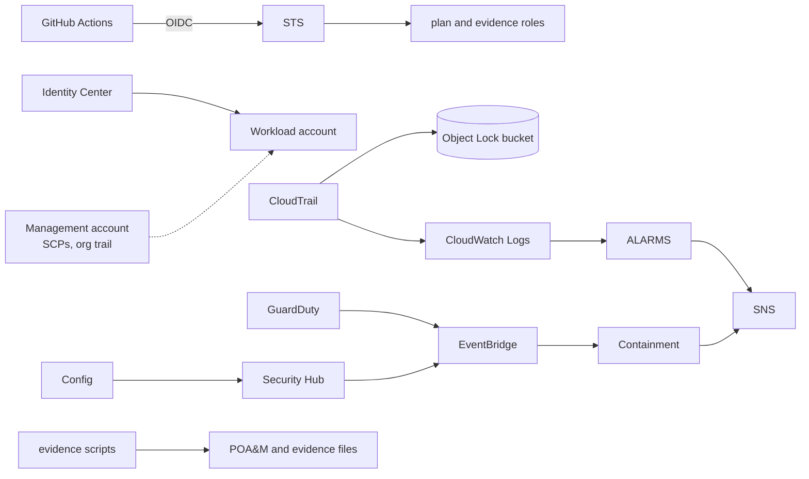

# FedRAMP Moderate baseline on AWS

Terraform, documentation and evidence tooling for a SaaS company that must
demonstrate FedRAMP Moderate Equivalency on commercial AWS.

Every standard, regulation and vendor document this implementation follows,
the official reference implementation that confirms each pattern, and the file
in this repository that applies it are listed in [STANDARD.md](STANDARD.md).

## The problem

A SaaS provider whose customers are U.S. defense contractors has to meet
CMMC Level 2. CMMC requires that any cloud service holding Controlled
Unclassified Information is either FedRAMP Moderate authorized or proves
FedRAMP Moderate Equivalency: an independent assessor (3PAO) verifies that
all controls of the NIST SP 800-53 Rev 5 Moderate baseline, about 325 of them,
are implemented, documented and backed by evidence.

Most of those controls are technical. They have to exist in the AWS account,
not in a policy document, and the assessor expects three things for each one:
how it is implemented, where the evidence is, and what happens when it fails.
A first security hire typically has one quarter to get there.

## The solution

Treat the baseline as code and the evidence as a build artifact.

- Every control that can be expressed in infrastructure is a Terraform
  resource with the control id next to it.
- Every control is listed in a matrix with its responsibility (inherited from
  AWS, shared, or customer), the Terraform that implements it, the Security
  Hub or Config check that evaluates it, and the command that proves it.
- The controls an assessor spends the most time on have narratives written in
  the format a System Security Plan uses.
- A read-only script exports the evidence from the account every week, and a
  second script turns open findings into a FedRAMP format Plan of Action and
  Milestones with the required 30/90/180 day deadlines.
- High severity threats trigger automated containment, and the runbooks pick
  up where the automation stops.
- Nothing in the code is invented: each policy, setting and procedure is traced
  to the standard or AWS documentation it comes from in [STANDARD.md](STANDARD.md).

## What was built

The code was applied to a real account: 177 resources in the workload account
and one organization trail in the management account. `terraform plan` reports
no drift and checkov passes with every exception justified inline.

| Module | What it creates | Controls |
|---|---|---|
| `org` | Organization units and five service control policies: no leaving the organization, no root use, no disabling of security services, no activity outside approved regions, IMDSv2 required | AC-6, AU-9, CM-7, SC-7 |
| `identity` | Password policy, GitHub OIDC provider with a read-only plan role and a main-branch-only evidence role, Identity Center permission sets with a developer permissions boundary | AC-2, AC-6, IA-2, IA-5 |
| `logging` | Multi-region CloudTrail with log file validation into an S3 Object Lock bucket, KMS keys per purpose, CloudWatch Logs with 14 CIS alarms, encrypted SNS topic, AWS Config recorder with seven years of history | AU-2, AU-6, AU-9, AU-11, CM-8 |
| `crypto` | Customer managed data key with separated administrator and user statements, EBS encryption by default, account-wide S3 public access block | SC-12, SC-13, SC-28 |
| `detection` | GuardDuty with all protection plans, Security Hub with the NIST 800-53 Rev 5, NIST 800-171 Rev 2 and AWS FSBP standards, the NIST 800-53 conformance pack with FedRAMP parameters, organization Config aggregator, Inspector, Access Analyzer, EventBridge rules for high severity findings | CA-7, RA-5, SI-4 |
| `network` | Three tier VPC with no NAT gateway, deny-by-default network ACLs, FIPS variants of VPC interface endpoints, flow logs, quarantine security group | SC-7, AC-4, AU-12 |
| `edge` | CloudFront with a private S3 origin, HTTPS redirect, security headers, WAFv2 managed rule groups and rate limiting, access and WAF logs | SC-5, SC-8, SI-10 |
| `data` | Aurora MySQL Serverless v2 that scales to zero, TLS required by the engine, IAM database authentication, CMK encryption, audit logs, RDS managed master secret | SC-28, IA-5, CP-9 |
| `respond` | Lambda that deactivates a compromised access key and attaches a deny-all policy, or snapshots and quarantines an EC2 instance, then reports with the runbook to follow | IR-4, IR-6 |
| `management/` | The organization trail, created from the management account into the workload account's bucket | AU-9(2) |

Documentation and evidence:

| Path | Content |
|---|---|
| `controls/control-matrix.csv` | 80 controls with responsibility, implementation, Terraform reference, checks, evidence and status |
| `controls/narratives/` | 20 control narratives in SSP format with FedRAMP parameter values, evidence tables and known gaps |
| `docs/authorization-boundary.md` | Boundary diagram, interconnections, where CUI lives, data flows, ports and protocols |
| `docs/fips-140.md` | Validated versus compliant, where FIPS endpoints are used, what the OS and application layers still need |
| `docs/resource-inventory.md` | Inventory generated from Terraform state |
| `runbooks/` | IR-001 compromised credential, IR-002 GuardDuty finding, VM-001 vulnerability management |
| `evidence/collect.py` | Exports Security Hub, Config, IAM, GuardDuty, Inspector, Access Analyzer, CloudTrail, KMS and alarm state through FIPS endpoints |
| `evidence/poam.py` | Builds the POA&M from open findings; `poam-exceptions.csv` holds accepted deviations with rationale |
| `scripts/management/` | PowerShell script that opens regions in the organization SCP and registers the workload account as delegated administrator |
| `.github/workflows/` | Static analysis with an OIDC smoke test on every push, weekly evidence export |

## How the pieces fit



## Running it

Prerequisites: Terraform 1.9 or newer, AWS CLI v2, Python 3.12 with boto3,
credentials for the workload account and, for the organization pieces, the
management account.

```bash
AWS_REGION=us-east-1 scripts/preflight.sh
cd terraform
cp terraform.tfvars.example terraform.tfvars
terraform init && terraform plan -out=lab.tfplan && terraform apply lab.tfplan
cd management
cp terraform.tfvars.example terraform.tfvars
terraform init && terraform apply
```

Then register the delegated administrators from the management account and
collect the first evidence set:

```bash
pwsh scripts/management/Configure-MemberAccount.ps1 -Profile mgmt -MemberAccountId <account> -AllowedRegions us-east-1
python evidence/collect.py --drift
python evidence/poam.py
python scripts/inventory.py
```

Order matters: the workload account first, the management root second, the
delegation last, because delegation enables GuardDuty and Security Hub on its
own and Terraform must create them first.

## Lab notes

The lab runs in a member account of a three account organization in
us-east-1, which is the delegated administrator for CloudTrail, Config,
GuardDuty, Security Hub, Inspector and Access Analyzer. Differences from a
production deployment are variables, not code:

| Topic | Lab | Production |
|---|---|---|
| Object Lock | GOVERNANCE, one day | COMPLIANCE, one year or more |
| Log retention | 400 days | per OMB M-21-31 |
| CloudFront TLS | default certificate, minimum TLSv1 | custom certificate, TLSv1.2_2021 |
| Identity Center | code only, delegated to another account | applied with the corporate IdP |
| Service control policies | AWS generated policies plus the management script | the five policies in `modules/org` |
| Evidence | workflow artifact | evidence bucket with Object Lock |

Two provider limitations shaped the layout. An organization trail is owned by
the management account even when a delegated administrator creates it, and the
AWS provider cannot read it back from the member account, so the organization
trail lives in `terraform/management`. CloudFront pins the minimum TLS version
to TLSv1 with its default certificate, so TLSv1.2_2021 needs a custom domain.

## Cost and teardown

With the free trials of GuardDuty, Security Hub and Inspector running, the lab
costs about 50 USD a month, most of it VPC interface endpoints and WAF; both
can be turned off with a variable. `terraform destroy` in the management root
and then in the workload root removes everything. Regional delegation must be
removed from the management account first, because a delegated administrator
cannot delete its own GuardDuty detector or Security Hub.

## Note on the CI jobs that talk to AWS

Two workflow jobs assume AWS roles through GitHub OIDC: the smoke test in
`plan.yml` (read-only `terraform plan`) and the weekly export in
`evidence.yml`. They exist to demonstrate a pipeline with no stored AWS keys
and automated evidence collection; the baseline itself does not depend on them
and they are skipped until the repository is configured. To run them, set
three repository variables with the values from `terraform output identity`
and the deployment region:

```bash
gh variable set AWS_PLAN_ROLE_ARN     --body "<github_plan_role_arn>"
gh variable set AWS_EVIDENCE_ROLE_ARN --body "<github_evidence_role_arn>"
gh variable set AWS_REGION            --body "us-east-1"
```

Repository variables are not masked in workflow logs, so the role ARNs, and
with them the account id, become visible in the public run output. If that
matters, store the same values as repository secrets and change `vars.` to
`secrets.` in the two workflow files; secrets are redacted from logs.
