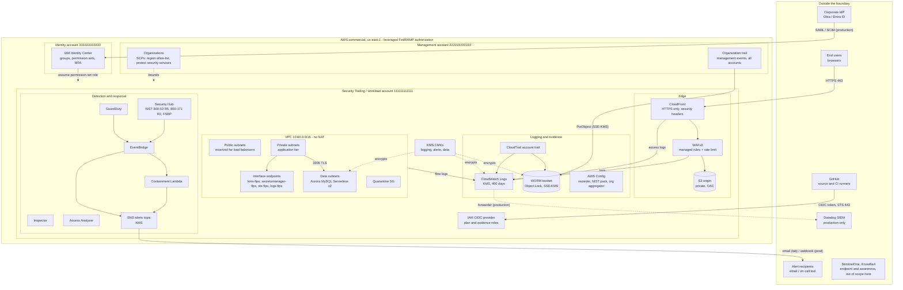

# Authorization boundary

The authorization boundary is the set of components the FedRAMP Moderate
Equivalency assessment covers: everything inside is assessed against the
NIST SP 800-53 Rev 5 Moderate baseline; everything outside is either a
leveraged authorization (AWS itself), an interconnection with its own
agreement, or simply not in scope.

This document is the technical input to the SSP sections "System Description",
"Authorization Boundary Diagram", "Network Diagram", "Data Flow Diagram" and
"Ports, Protocols and Services".

## Boundary diagram

## What is inside

| Component | Account | Why it is inside |
|---|---|---|
| CloudFront distribution, WAF web ACL, S3 origin | Security Tooling | The only public entry point; processes user requests |
| VPC, subnets, NACLs, security groups, endpoints, flow logs | Security Tooling | Hosts and isolates the workload tiers |
| Aurora MySQL cluster, its secret, its parameter group | Security Tooling | Stores application data (CUI in the target system) |
| CloudTrail trails (account and organization), audit buckets, CloudWatch Logs groups | Security Tooling (storage), management (org trail) | Audit record generation and protection |
| AWS Config recorder, conformance pack, aggregator | Security Tooling | Configuration baseline and continuous assessment |
| GuardDuty, Security Hub, Inspector, Access Analyzer | Security Tooling (delegated administrator) | Detection and continuous monitoring |
| EventBridge rules, containment Lambda, SNS topic, SQS DLQ | Security Tooling | Incident handling automation |
| KMS customer managed keys | Security Tooling | All encryption at rest inside the boundary |
| IAM roles, OIDC provider, password policy | Security Tooling | Non-human access and account-level settings |
| SCPs, organization trail | Management | Preventive guardrails and organization-wide audit |
| Identity Center instance, groups, permission sets | Identity account | Human authentication and authorization |

## What is outside, and how it is treated

| System | Relationship | Data exchanged | Protection | SSP treatment |
|---|---|---|---|---|
| AWS (regions us-east-1 / us-west-2, services listed above) | Leveraged authorization: AWS US East/West FedRAMP High (JAB) | n/a | Inherited physical, environmental, hypervisor, KMS HSM controls | Section "Leveraged Authorizations"; inherited rows in the control matrix |
| GitHub (repository, Actions) | Interconnection | Infrastructure code (no secrets), OIDC tokens, read-only API responses, evidence files | OIDC federation with aud/sub conditions, read-only roles, branch-restricted evidence role | Interconnection Security Agreement; vendor SOC 2 review |
| Corporate IdP (Okta / Entra ID) | Interconnection (production) | SAML assertions, SCIM user and group provisioning | SAML signing, SCIM bearer token, MFA at the IdP and in Identity Center | ISA; vendor FedRAMP authorization (Okta has one) |
| Datadog SIEM | Interconnection (production) | Copies of CloudTrail, flow, WAF, application logs; alert webhooks | TLS, Datadog FedRAMP Moderate authorized instance (us1-fed), API key in Secrets Manager | ISA; leveraged authorization for the SIEM function |
| Alert recipients (email, on-call tool) | Interconnection | Alarm and finding summaries, no CUI | SNS over TLS, no secrets in messages | Procedural: IR plan contact list |
| End users | External users | Application requests and responses over HTTPS | WAF, TLS, security headers, authentication by the application | System users section |
| SentinelOne, KnowBe4 | Corporate IT, outside this system boundary | Endpoint telemetry, training records | Separate assessment | Referenced for AT-2, SI-3 on endpoints |

## Where CUI lives

In the target system (FieldFlo-style SaaS), Controlled Unclassified Information
would be customer project data in the application. In this baseline the data
locations and their protections are:

| Location | Encryption at rest | In transit | Access |
|---|---|---|---|
| Aurora cluster storage, snapshots, Performance Insights | KMS data key (CMK) | TLS required by `require_secure_transport` | Security group from private subnets only; IAM database authentication |
| Secrets Manager (DB master secret) | KMS data key | TLS, FIPS endpoint from the VPC | RDS-managed; IAM policies |
| S3 origin bucket | SSE-S3 | TLS enforced by bucket policy | CloudFront OAC only; contains public static content, no CUI |
| Audit logs (S3, CloudWatch Logs) | KMS logging key | TLS enforced | Read-only roles; WORM retention; may contain CUI metadata (object keys, identities), treated as CUI |
| Application tier (future EKS / EC2) | EBS default encryption with CMK | TLS to data tier and endpoints | IAM roles per workload (IRSA in Project 2) |

CUI must not leave the boundary. Concretely: no NAT gateway, so nothing in the
private tiers can reach an external model API, SaaS or update server without an
explicit, reviewed egress path (a future NAT with a domain allow-list or a
Network Firewall). Any feature that calls a hosted model would use Amazon
Bedrock inside the boundary through a VPC endpoint, never an external provider.

## Data flows

1. **User request.** Browser → CloudFront (TLS termination, HSTS) → WAF evaluation → origin (S3 today; an ALB in the public subnets in front of the application tier later). Logged at CloudFront and WAF.
2. **Application to database.** Private subnet → security group → Aurora on 3306 with TLS; credentials from Secrets Manager over the `secretsmanager-fips` endpoint, or IAM auth tokens over `sts-fips`.
3. **Administration.** Engineer → Identity Center (MFA) → permission set role in the Security Tooling account → AWS console or CLI over TLS. Every call lands in CloudTrail.
4. **CI/CD.** GitHub Actions → OIDC token → STS → plan role (read-only) or evidence role (main branch only). No stored credentials.
5. **Audit.** All accounts → organization trail → WORM bucket in the Security Tooling account; the account trail also streams to CloudWatch Logs for alarms. Flow logs, WAF, CloudFront, Aurora and Lambda logs land in encrypted log groups.
6. **Detection and response.** GuardDuty / Security Hub / Inspector → EventBridge → SNS (humans) and Lambda (containment) → SNS report. Datadog receives log copies in production.
7. **Evidence.** Weekly workflow assumes the evidence role, exports Security Hub, Config, IAM and inventory data into the repository (Day 5).

## Ports, protocols and services

| Source | Destination | Port / protocol | Purpose | Enforcement |
|---|---|---|---|---|
| Internet | CloudFront | 443/TCP TLS (80 redirects) | Application access | CloudFront, WAF |
| CloudFront | S3 origin | 443/TCP TLS, SigV4 | Content fetch | Bucket policy with SourceArn |
| Private subnets | Data subnets | 3306/TCP TLS | Database | SG + NACL + `require_secure_transport` |
| Private and data subnets | VPC interface endpoints | 443/TCP TLS | KMS, Secrets Manager, STS, Logs | Endpoint SG from VPC CIDR |
| Private and data subnets | S3 / DynamoDB gateway endpoints | 443/TCP TLS | Object storage, tables | Route tables, NACL egress 443 |
| GitHub Actions | STS, AWS APIs | 443/TCP TLS | CI | OIDC trust policy |
| AWS services | S3 audit buckets, KMS, CloudWatch Logs | AWS internal | Log delivery | Service principal conditions (SourceArn / SourceAccount) |
| SNS | Email / webhook | 443/TCP TLS | Alerts | Topic policy, KMS |

No SSH (22), RDP (3389), or any inbound administrative protocol is admitted
anywhere; the NACL ephemeral ranges are split so 3389 is never open from the
internet, and Session Manager over the `ssm-fips` endpoint would be the
administrative path for any future instance.

## Inheritance from AWS

Controls satisfied by the AWS FedRAMP authorization and leveraged without
customer action: PE family, MP family (media), physical network, hypervisor
isolation, KMS HSM FIPS 140-3 validation, time source (AU-8), vulnerability
management of the managed services themselves. Evidence is the AWS FedRAMP
package obtained through AWS Artifact and listed in the SSP as a leveraged
authorization.

## Lab versus target system

| Aspect | Lab | Target system |
|---|---|---|
| Accounts | 3 (management, identity, security/workload combined) | Separate workload (prod, staging) accounts under a Workloads OU; Security Tooling account only holds tooling |
| Identity | Identity Center built-in store | Federated to Okta / Entra ID with SCIM |
| SIEM | CloudWatch Logs + alarms | Datadog FedRAMP instance fed by Kinesis / forwarder |
| Edge TLS | Default CloudFront certificate | Custom domain, ACM, TLSv1.2_2021 |
| Application tier | Not deployed (Project 2 adds EKS) | EKS with IRSA, Bottlerocket FIPS nodes |
| Object Lock | GOVERNANCE, 1 day | COMPLIANCE, 365+ days |
| Backups | Aurora automated | AWS Backup plan, vault lock, cross-region copy |
